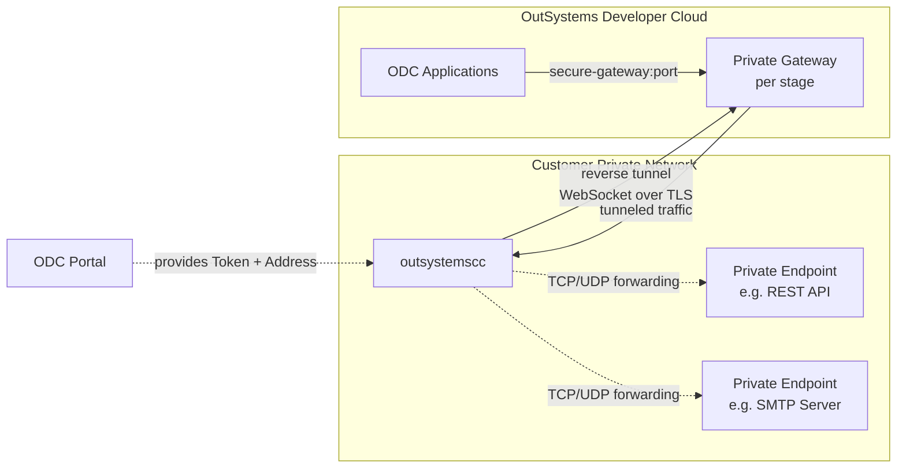
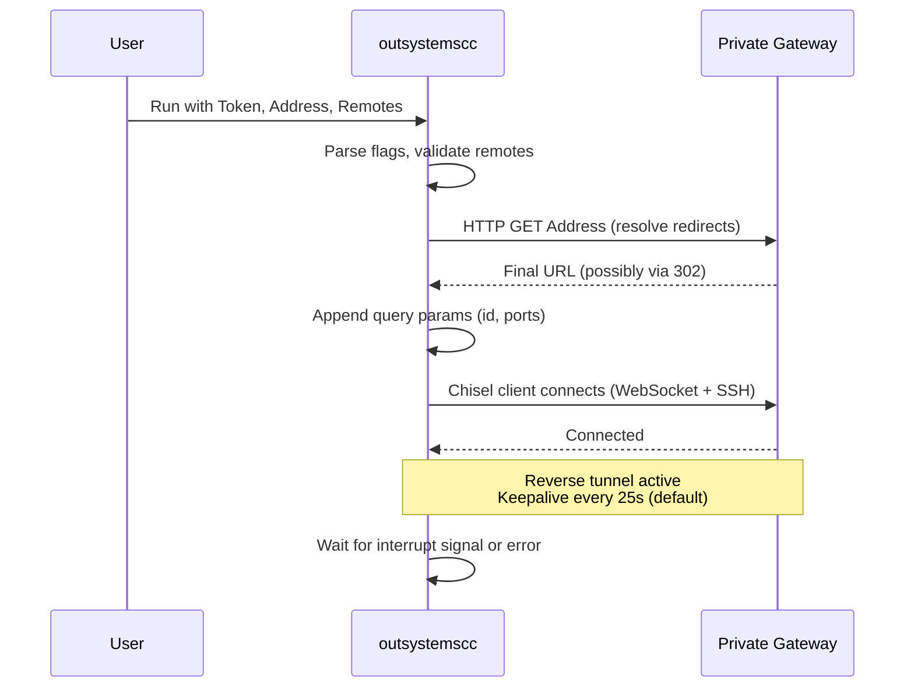

# Architecture

## Overview

OutSystems Cloud Connector (`outsystemscc`) is a CLI tool that establishes secure reverse tunnels between private network endpoints and OutSystems Developer Cloud (ODC) Private Gateways. It enables ODC applications to reach services (REST APIs, SMTP, databases, etc.) that are not exposed to the public internet.

The tool is a thin wrapper around a forked version of [chisel](https://github.com/jpillora/chisel) (`github.com/outsystems/chisel`), adding OutSystems-specific connection logic: server URL resolution (with redirect handling), remote validation, query parameter generation, and token-based authentication via HTTP headers.

## System Context



Traffic flow:
1. An operator activates a Private Gateway for a stage in the ODC Portal, obtaining a **Token** and **Address**.
2. `outsystemscc` uses these to establish a reverse tunnel (WebSocket over HTTPS, secured with SSH/ECDSA) to the Private Gateway.
3. ODC applications address the private endpoints as `secure-gateway:<port>`. Traffic is routed through the Private Gateway, across the tunnel, to the target endpoint in the customer's network.

## Code Structure

The entire application lives in a single Go package (`main`) with two source files:

```
cloud-connector/
  main.go          -- CLI entry point and all application logic
  main_test.go     -- Unit tests for remote validation and URL fetching
  Dockerfile       -- Distroless-based container image
  .goreleaser.yaml -- Build and release configuration (Linux binaries + Docker)
  go.mod / go.sum  -- Go module definition
```

### main.go -- Component Breakdown

| Function | Responsibility |
|---|---|
| `main` / `client` | CLI flag parsing, orchestration of the connection lifecycle |
| `fetchURL` | HTTP GET to the server address; follows 302 redirects to resolve the actual tunnel endpoint |
| `validateRemotes` | Parses and validates remote definitions (`R:local:host:remote`); rejects duplicate local ports |
| `generateQueryParameters` | Builds query string with a random session ID and declared local ports |
| `createHTTPClient` | Creates a `resty` HTTP client, optionally configured with a proxy |
| `generatePidFile` | Writes the process PID to `outsystemscc.pid` for process management |
| `headerFlags` | Custom `flag.Value` implementation for `--header` key:value pairs |

### Connection Lifecycle



## Key Dependencies

| Dependency | Purpose |
|---|---|
| `github.com/outsystems/chisel` (fork of `jpillora/chisel` v1.11.3-os.1) | Core tunneling engine -- WebSocket transport, SSH encryption, reverse port forwarding |
| `github.com/go-resty/resty/v2` | HTTP client for server URL resolution and redirect handling |
| `github.com/gorilla/websocket` | WebSocket protocol (transitive, via chisel) |
| `golang.org/x/crypto` | SSH cryptographic primitives (transitive, via chisel) |

The `replace` directive in `go.mod` pins chisel to the OutSystems fork, which contains platform-specific modifications.

## Build and Release

**GoReleaser** (`.goreleaser.yaml`) produces:
- Linux binaries for `386`, `amd64`, and `arm64`
- A Docker image published to `ghcr.io/outsystems/outsystemscc`

The Docker image is a minimal Distroless container with the static binary copied to `/app/outsystemscc`.

**Dependabot** runs monthly to keep Go module dependencies up to date.

## Network and Security Model

- **Outbound-only**: `outsystemscc` initiates all connections. No inbound ports need to be opened in the customer's firewall.
- **Transport encryption**: HTTP transport upgraded to WebSocket, encrypted with SSH (ECDSA + SHA256). The outer connection uses TLS (port 443) with a valid X.509 certificate.
- **Authentication**: A token (issued by the ODC Portal) is passed as an HTTP header on the tunnel connection.
- **Proxy support**: HTTP CONNECT and SOCKS5 proxies are supported for environments where direct outbound access is restricted.
- **Keepalive**: Configurable interval (default 25s) to prevent intermediate proxies from closing idle connections.
- **Retry**: Automatic reconnection with configurable max retry count and interval.

## Architectural Principles

1. **Single binary, zero runtime dependencies** -- The tool is a statically compiled Go binary. No interpreters, shared libraries, or configuration files are required.
2. **Outbound-only connectivity** -- The tunnel is initiated from the private network side, avoiding the need for inbound firewall rules.
3. **Thin wrapper over proven tunneling** -- Application logic is minimal. The heavy lifting (WebSocket transport, SSH encryption, port forwarding) is delegated to chisel.
4. **Platform as Linux, distribute as container** -- Binaries target Linux only. Windows users run via WSL or Docker.
